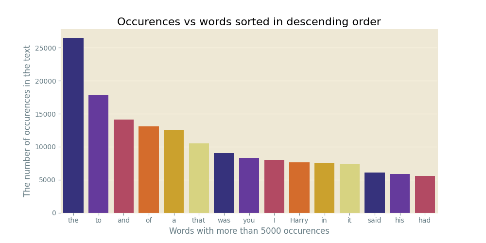
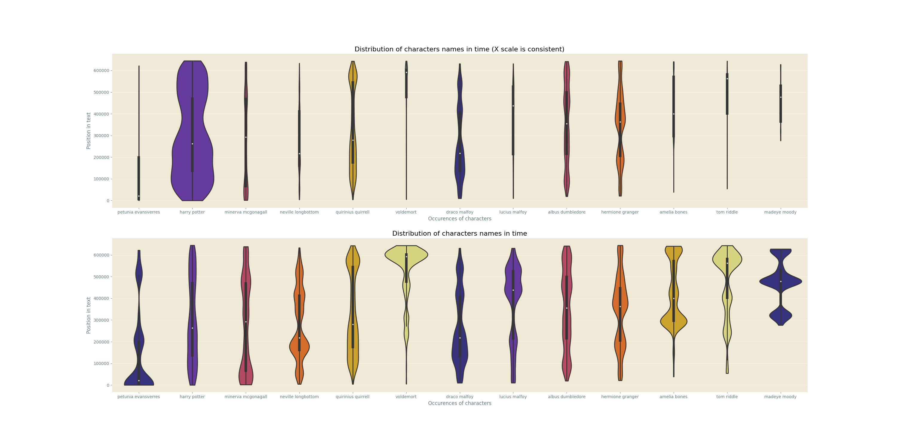
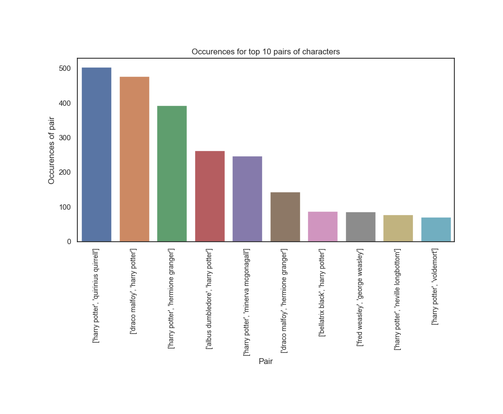
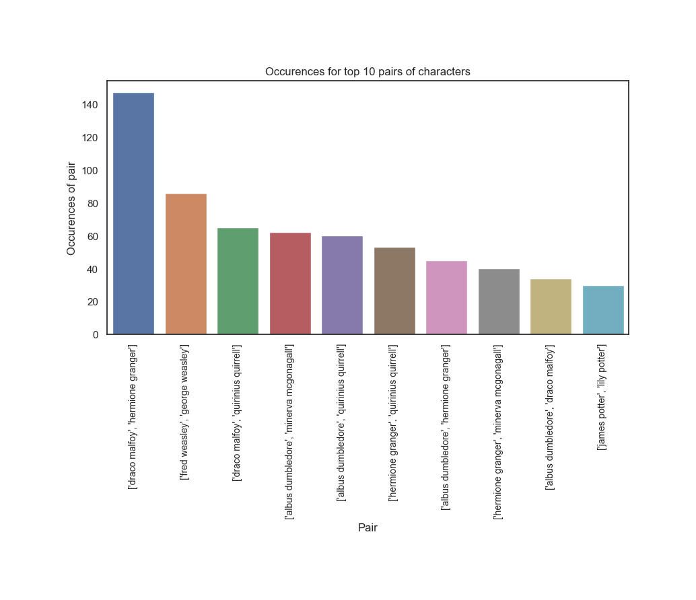

# HPMOR Analysis

## Table of Content
---
- [**What is HPMOR?**](#What-is-HPMOR?)
- [What are the files?](#What-are-the-files?)
- [What did I gain from analysis?](#What-did-I-gain-from-analysis?)
- [Built With](#built-with)

### What is HPMOR?
---
HPMOR is a book written by Eliezer Yudkowski http://www.hpmor.com/ which is based on the Harry Potter Series. 
<p align="center">
  
</p>
The acronym HPMOR stands for `Harry Potter and the methods of rationality`. It has a 96% approval rating on google(at the time of writing). It focuses mainly on presenting concepts of Bayesian Rationality in a simple way. It is definetely worth a read, but the Harry Potter series is a requisite to understand all the jokes.

### What are the files?
---
This repository consists of two main files, `main.py` and `viz/visualisation.ipynb`. The `main.py` file is responsible for converting the book to the two `data.csv` and `data_chars.csv` files, which are then evaluated and visualized by the `viz/visualisation.ipynb` jupyter notebook.

### What did I gain from analysis?
---

#### General Analysis
---
First I analysed the data in the `data.csv` file, which contains every single word and it's position.

As expected this list generally follows the list of english word frequencies. One interesting observation is that the word Harry is extremely common, even more so than `in`, `it`, `his`, etc...


This graph shows us the words with more than 5 letters and their occurences. Interestingly The most used word with more than 5 characters is not a word with 5 characters but `Professor`, which is much longer. This is not unexpected due to the setting of the story. We also observe that mostly names, with the exception of `thought` appear here. You might say `Professor` is not a name, but the typical usage of the word, to address Quirrel or McGonagall leads me to consider it as one. Back to `thought`: The story is about rationality, therefore thought is also expected to figure relatively high up on the list. The inclusion of `thought` but not `belief` is notable though.


While looking at this graph you have to remember the y-axis was scaled logarithmically, and the gap between words with a length of 84 chars and 1 is even more abyssal than pictured here.
This graph poses more questions than it answers though! What words are 84 characters long!?, you might ask. Here is a list of the words sorted in descending order by length:
```
Longest words: 
 
Luminosluminosluminosluminosluminosluminosluminosluminosluminosluminosluminosluminos
stickyourneckoutandmakeapredictionorstoppretendingtobelieveinyourtheory
Someonemightactuallygenuinelygetkilled
possiblynotjustpretendingtobecrazy
bodyhittingthegroundwithathuddish
impossibletopredictorunderstand
BoyWhoLivedUnlikeHisBestFriend
whatevertheheckwaswrongwithhim
AAAAAAAAAAAAAAHHHHHHHHHHHHHHH
informationsearchandretrieval
perhapsridiculouslyexpensive
scrambledengineblueprints
AIIIIIIIIIIEEEEEEEEEEEEEE
tenandthreequarterinches
possiblyultrahighquality
notreallychildrenanymore
BoyWhoDestroyedADementor
PotterEvansVerresGranger
GrangerPotterEvansVerres
PotterEvansVerresGranger
```
Most of these were seperated by dashes ("`-`"), which were then erased while extracting.

#### Character specific analysis
---
I searched for names in a list of names:
``` python
charlist_lower = ['hannah abbott', 'amelia bones', 'susan bones', 'lavender brown', 'bellatrix black', 'penelope clearwater', 'albus dumbledore', 'dudley dursley', 'vernon dursley', 'petunia evansverres', 'fawkes', 'filius flitwick', 'hermione granger', 'daphne greengrass', 'neville longbottom', 'draco malfoy', 'lucius malfoy', 'narcissa malfoy', 'minerva mcgonagall', 'madeye moody', 'theodore nott', 'padma patil', 'parvati patil', 'peter pettigrew', 'harry potter', 'james potter', 'lily potter', 'quirinius quirrel', 'tom riddle', 'rita skeeter', 'sybill trelawney', 'voldemort', 'ron weasley', 'blaise zabini', 'george weasley', 'fred weasley', 'molley weasley', 'arthur weasley']
```
and then in that same list but split by spaces:
``` python
charlist_split_lower = ['hannah', 'abbott', 'amelia', 'bones', 'susan', 'bones', 'lavender', 'brown', 'bellatrix', 'black', 'penelope', 'clearwater', 'albus', 'dumbledore', 'dudley', 'dursley', 'vernon', 'dursley', 'petunia', 'evansverres', 'fawkes', 'filius', 'flitwick', 'hermione', 'granger', 'daphne', 'greengrass', 'neville', 'longbottom', 'draco', 'malfoy', 'lucius', 'malfoy', 'narcissa', 'malfoy', 'minerva', 'mcgonagall', 'mad-eye', 'moody', 'theodore', 'nott', 'padma', 'patil', 'parvati', 'patil', 'peter', 'pettigrew', 'harry', 'potter', 'james', 'potter', 'lily', 'potter', 'quirinius', 'quirrel', 'tom', 'riddle', 'rita', 'skeeter', 'sybill', 'trelawney', 'voldemort', 'ron', 'weasley', 'blaise', 'zabini', 'george', 'weasley', 'fred', 'weasley', 'molley', 'weasley', 'arthur', 'weasley']
```
If `potter` came up, there is a ambiguity which of the 3 Potters is. I would then search for the first occurence of that word in the `charlist_lower` list. For `potter` this algorithm would result in the occurence being attributed to `harry potter`.

Now to the fun stuff, the graphs.

I created a violin plot of the occurences of each name in time.

This is a big plot, I would suggest you open the image in fullscreen. The first one applies a consistent scale on the x-axis of each of the singular violin plots, and you can see that `harry potter` is by far the most common name, which is not surprising give that he is the main character. `draco malfoy` and `hermione granger are the next on the list. 
The second plot has an independant scale on the x-axis for every single violin. You can see that the usage of `petunia` declines, because Harry goes to Hogwarts. One could explain each of the observations in a similar way.


This plot presenting the same information as the violin plot, but in a ridgeline format. The occurences are also not scaled globally. The spike in `Voldemort` can be explained by the reveal who he really is.

#### Character pairs
---


I constructed a list of names occuring within 10 words of each other. These are the top 10 pairs.
The top pair of characters is `draco malfoy, harry potter`, this makes sense because they are the main characters. Almost every pair consists of `harry potter, ?`, with multiple exceptions, one of them quite funny: `george weasley, fred weasley`.


If we exclude `harry potter, ?` pairs `draco malfoy, hermione granger` dominates the ranking.

#### Interactive Network
---

I strongly suggest looking at [the interactive network visualisation made with pyvis.network](https://htmlpreview.github.io/?https://raw.githubusercontent.com/obrhubr/hpmor-datascience/master/viz/net.html).

### Built With
---
- [Python](https://www.python.org/)
- [Seaborn](https://seaborn.pydata.org/)
- [Pandas](https://pandas.pydata.org/)
- [Matplotlib](https://matplotlib.org/)